# Architecture

<!-- status: draft | approved -->
| Field | Value |
|---|---|
| status | approved |
| created | 2026-05-03 |

## System Overview <!-- required -->

`weaver-rs` is a layered library. At the bottom sit **primitives** — `Message`, `AgentState<T>`, `Tool`, `ToolCall`, `ToolResult`. Above them sit **traits** that define pluggable behavior: `Tool`, `LlmClient`, `Checkpoint`, `Memory`, `StructuredOutput`. On top of the traits sit **strategies** — concrete implementations of `AgentStrategy<S>` for ReAct, ReWOO, LLMCompiler, and reflection loops. Strategies are driven by a **graph runtime** that owns the state, dispatches to strategy steps, and routes between nodes via typed edge conditions. A **multi-agent runtime** layers on top of the single-agent runtime, holding a map of agents that coordinate through a `tokio::broadcast` message bus.

The compiler is the primary enforcement mechanism: graph state is a generic `S: Send + 'static`, structured output is `S: DeserializeOwned + JsonSchema + Send`, and edge conditions are typed predicates over `&S`. Stringly-typed state lookups are deliberately absent.

## Component Map <!-- required -->

- **`primitives/`** — concrete types used everywhere
  - `state.rs` — `AgentState<T>`, `ReflectionState`, `RunMeta`
  - `message.rs` — `Message`, `Role`, `MessageContent`
  - `tool.rs` — `ToolCall`, `ToolResult`, `ToolCallId`
- **`traits/`** — abstract interfaces consumers implement or pick from built-in adapters
  - `tool.rs` — `Tool` (name, schema, async call)
  - `output.rs` — `StructuredOutput` marker for state-bound outputs
  - `checkpoint.rs` — `Checkpoint` for save/restore of `AgentState<T>`
  - `memory.rs` — `Memory` for long-term recall across runs
  - `llm.rs` *(planned)* — `LlmClient` adapter trait
- **`graph/`** *(planned)* — `Graph<S>`, `GraphBuilder<S>`, `NodeId`, `EdgeCondition<S>`, `AgentCtx<S>`
- **`strategy/`** *(planned, feature-gated)* — `AgentStrategy<S>` trait plus `react`, `rewoo`, `compiler`, `reflection` impls
- **`runtime/`** *(planned)* — `SingleAgentRuntime<S>` and (under `multi` feature) `MultiAgentRuntime<S>` with `AgentMessage` bus
- **`tools/`** *(planned)* — `ToolRegistry` for registration, schema export, and `dispatch_parallel`
- **`llm/`** *(planned)* — built-in `LlmClient` adapters (provider list TBD; see Open Decisions)
- **`error.rs`** — crate-wide `Error` and `Result`
- **`tests/`** — integration tests exercising end-to-end graph runs against `MockLlmClient`
- **`examples/`** — runnable demos per strategy/feature (canonical proof-of-correctness)

## Data Flow <!-- required -->

1. **Initialization.** Consumer constructs an `AgentState<T>` (or custom `S`), a `ToolRegistry`, an `LlmClient` adapter, and a `Graph<S>` via `GraphBuilder`. The builder validates structure at build time.
2. **Run start.** `SingleAgentRuntime::run(initial_state)` enters the start node and invokes the strategy's `step(&mut AgentCtx<S>)`.
3. **Strategy step.** The strategy emits one of:
   - `AgentAction::CallTools(Vec<ToolCall>)` — dispatched through `ToolRegistry` (parallel for ReWOO/Compiler, serial for ReAct), results appended to `state.messages`.
   - `AgentAction::Respond(String)` — appended to `state.messages` as an assistant message.
   - `AgentAction::Transition(NodeId)` — runtime routes to the target node.
   - `AgentAction::Done` — runtime exits, returning the final state.
4. **Edge evaluation.** When a node returns a `NodeId`, the runtime evaluates outgoing `EdgeCondition<S>` predicates against current state to pick the next node.
5. **Structured output.** When the LLM emits structured output matching `T`, the strategy deserializes via `serde_json` into `state.output` (or the consumer's typed slot) and the graph terminates at the `End` node.
6. **Checkpointing (optional).** Between steps, the runtime calls `Checkpoint::save(&state)` if a checkpoint adapter is configured. `Checkpoint::load` restores a run by `run_id`.
7. **Multi-agent (optional).** Under the `multi` feature, each agent runs in its own `tokio::task` and reads/writes a shared `tokio::broadcast::Sender<AgentMessage>` bus. Agents do not share `S` directly.

## External Dependencies <!-- required -->

- **`tokio`** — async runtime, task spawning, broadcast channels for the multi-agent bus.
- **`serde` / `serde_json`** — serialization of state, messages, and tool input/output JSON.
- **`schemars`** — JSON Schema generation for structured output and tool input schemas; injected into LLM prompts.
- **`async-trait`** — async methods on `Tool`, `LlmClient`, `AgentStrategy`, `Checkpoint`, `Memory`.
- **`thiserror`** — typed crate error.
- **`chrono`**, **`uuid`** — timestamps and run IDs in `RunMeta`.
- **LLM provider HTTP clients** *(planned, behind feature flags)* — exact set TBD; see Open Decisions.

## Key Constraints <!-- required -->

- **Type safety over runtime checks.** State shape, tool schemas, and edge predicates are checked at compile time. No stringly-typed state keys, no runtime "key not found" errors.
- **Strategy interchangeability.** Any `AgentStrategy<S>` impl must be swappable without changing graph or tool code. ReAct vs. ReWOO vs. LLMCompiler is a single trait-object swap.
- **Send + 'static for state.** State must cross task boundaries (multi-agent, checkpointing) without lifetime gymnastics on the consumer.
- **Feature-gated strategies.** Consumers pay only for what they use. `react` is the default; `rewoo`, `compiler`, `multi` are opt-in.
- **Determinism in tests.** All integration tests must be runnable offline with a `MockLlmClient`. No real network calls in CI.
- **Examples are load-bearing.** Every strategy and major feature ships a runnable `examples/` entry. CI builds all examples with `--all-features`.
- **No vendored secrets, no telemetry.** The library never phones home and never ships embedded credentials.

## Open Decisions <!-- optional -->

- Built-in LLM adapter set for v1 (OpenAI / Anthropic / generic OpenAI-compatible) and which feature flags gate them.
- Default checkpoint backend (in-memory only vs. shipping a file/SQLite reference impl).
- Whether `Memory` is one trait or split into short-term (conversation) and long-term (vector-backed) traits.
- Streaming surface — token-level vs. message-level events on `AgentCtx`.
- Cancellation semantics — `tokio::CancellationToken` on `AgentCtx`, or strategy-level deadlines.
- How `agent-as-tool` interacts with feature flags (does wrapping a multi-agent require `multi` transitively?).
